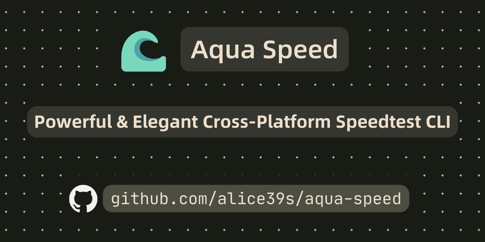

# :ocean: Aqua Speed

<div align="center" style="margin-bottom: 20px">



</div>

A modern network speed test CLI built with Bun and TypeScript.

<div align="center">

[](https://www.typescriptlang.org/)
[](https://bun.sh)
[](https://biomejs.dev/)
[](LICENSE)

</div>

<div align="center">

> English | [简体中文](README.zh.md)

</div>

## :star2: Features

- 🚀 High-performance speed testing powered by Bun runtime
- ✨ Multiple test servers support:
  - Cloudflare (download & upload)
  - LibreSpeed (download & upload) 
  - Ookla (TODO)
  - Custom file URL (download only) [^1]
- 🧵 Concurrent testing with configurable threads
- 📊 Comprehensive metrics:
  - TCP/ICMP/HTTP latency
  - Download/Upload speeds
  - Jitter analysis
- 🎨 Beautiful CLI interface with real-time progress
- 🛡️ Full TypeScript type support, Biome constrained code style.

# :star2: Demo

[](https://asciinema.org/a/nlNFF30p1fHw5iwm8eXEmRqq0)

## :fire: Run

### :rocket: Run from CI Build

Download the latest binary compressed package from [Releases](https://github.com/Alice39s/aqua-speed/releases)

#### Linux & macOS
```bash
chmod +x aqua-speed
./aqua-speed
```

#### Windows
```bash
./aqua-speed.exe 
```

### :whale: Run from Docker

```bash
docker run -it ghcr.io/alice39s/aqua-speed:latest
```

### :hammer_and_wrench: Run from Source

#### 1. Install Bun

```bash
# Linux & macOS
curl -fsSL https://bun.sh/install | bash

# Windows
powershell -c "irm bun.sh/install.ps1 | iex"

# Windows (Package Manager)
scoop install bun
```

#### 2. Clone repository

```bash
git clone https://github.com/Alice39s/aqua-speed.git
```

#### 3. Install dependencies

```bash
bun install
```

#### 4. Run

```bash
bun run start
```

## Basic Usage

### Quick Start
```bash
# Run with defaults (Cloudflare server, 4 threads)
aqua-speed

# Test against LibreSpeed server
aqua-speed --type LibreSpeed

# Test with custom file URL
aqua-speed -s https://example.com/testfile.dat
```

### Advanced Options

```bash
aqua-speed [options]

Options:
  -s, --server <url>     Speed test server URL
  --sn <name>            Speed test server name 
  -t, --thread <number>  Number of concurrent connections  
  --timeout <seconds>    Test timeout in seconds
  --debug               Debug mode
  --type <type>         Test type (SingleFile|LibreSpeed|Cloudflare)
```

## :mag: Example Output

```
Test Results:

    Latency:
        TCP: min = 1.25 ms, avg = 2.19 ms, max = 3.38 ms
        ICMP: min = 1.00 ms, avg = 1.00 ms, max = 1.00 ms
        HTTP: min = 97.74 ms, avg = 100.71 ms, max = 103.68 ms

    Speed:
        Download: min = 570.55 Mbps, avg = 1.17 Gbps, max = 1.36 Gbps
        Upload: min = 601.25 Mbps, avg = 1.20 Gbps, max = 1.39 Gbps

    Test Information:
        Server: speed.cloudflare.com
        Time: 2024/12/25 12:00:00
```

## :bug: Troubleshooting

### Common Issues

1. `Permission denied`

```bash
chmod +x aqua-speed
```

2. Low speeds
- Reduce threads: `-t 2`
- Test with different servers

### Debug Mode

Enable debug logging for detailed information:
```bash
./aqua-speed --debug
```

## :hammer_and_wrench: Development

```bash
# Install dependencies
bun install

# Run in development
bun run dev

# Run tests
bun test

# Build binary
bun run build:binary
```

### :scroll: Code Style

This project uses Biome for code formatting and linting (using `biome format` and `biome check`):

```bash
# Format code
bun run format

# Lint code
bun run lint
```

## :book: Changelog

See [CHANGELOG.md](CHANGELOG.md) for more details.

## :construction: Roadmap

See [Roadmap.md](Roadmap.md) for more details.

## :fork_and_knife: Contributing

1. Fork repository
2. Create feature branch
3. Commit changes
4. Run tests
5. Submit pull request

Please ensure:
- Tests pass
- Code follows Biome standards
- Commit messages are clear
- Documentation is updated

## :scroll: License

[GPL-3.0 License](LICENSE)

## :pray: Acknowledgements

- [Bun](https://bun.sh) - JavaScript runtime & toolkit
- [LibreSpeed](https://github.com/librespeed/speedtest) - Open source speed test
- All contributors

[^1]: Recommended to specify a file of at least 10MB.